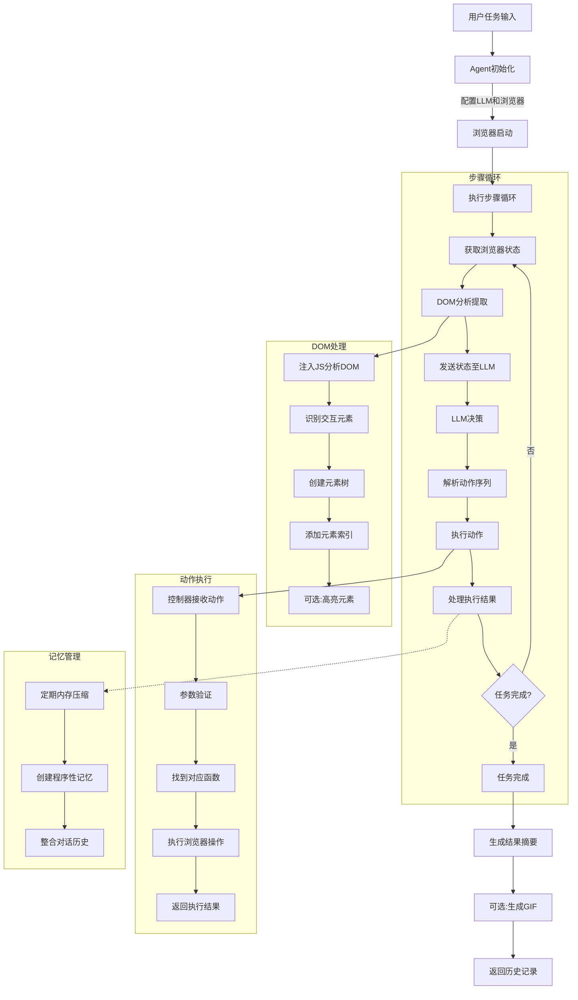

### 引言：当 AI 遇上浏览器

**Browser Use** 是一款由 AI 大模型驱动的浏览器自动化代理工具。它的核心能力在于能够将网站的按钮和界面元素转化为更易于 AI 理解的文本式格式，从而让 AI 智能体能够轻松地“读懂”网站并自动完成复杂任务。这项技术旨在解决传统基于视觉的系统在浏览网站时容易出错的问题，并降低重复执行相同任务的成本。

<!-- more -->

Browser Use 在2025年3月完成了一笔1700万美元的种子轮融资，由 Felicis Ventures 领投，A Capital、Nexus Ventures、Y Combinator、Paul Graham、Liquid2、SV Angel、Pioneer Fund 等跟投。

该项目的两位创始人 Gregor Zunic 和 Magnus Müller 均为苏黎世联邦理工学院的学生，他们在2024年相识，共同提出了将网络爬虫与数据科学结合的想法。他们仅用了五周时间便开发出了 Browser Use 的演示版本，并选择将其开源。其核心代码大约有 8000 行。这个开源项目在 GitHub 上迅速积累了超过 47k 个 Star，吸引了大量开发者的关注。

Browser Use 所瞄准的市场潜力是巨大的。据估计，全球有 6 亿知识工作者，他们每周将约 25%-40% 的时间投入到重复性任务中，其中相当一部分涉及网页操作。通过自动化这些耗时且单调的任务，Browser Use 有望显著提高生产力，释放巨大的经济价值，为企业和个人创造可观的效益，从而构成了一个潜力无限的市场。此外，其在企业级场景的应用前景也十分广阔，例如自动化销售线索搜集、竞品价格实时追踪、在线舆情监控、以及招聘过程中的简历初步筛选等。

Browser Use 近期的声名鹊起，部分原因是中国初创公司 Butterfly Effect 在其广为传播的 Manus 工具中采用了 Browser Use 技术。目前，Y Combinator 冬季批次中已有超过20家公司使用了 Browser Use 的解决方案。领投方 Felicis 的 Astasia Myers 表示，Web AI 代理是下一个真正有助于实现端到端人工任务自动化的前沿领域，它充当了不断变化的数字环境中以文本为中心的静态预训练模型之间的动态桥梁。

本文将从技术架构、核心模块、关键实现、应用场景等多个维度，对 Browser Use 进行全面而深入的剖析，带你领略这一前沿技术的魅力与潜力。

### 核心能力：Browser Use 能做什么？

Browser Use 提供了一套强大的功能集，使 AI 代理能够高效、智能地与 Web 环境交互。它实现了 **AI 驱动的浏览器控制**，通过健壮的代理架构，将 LLM 的决策能力与 Playwright 等底层自动化工具无缝对接。在与网页交互方面，它支持**丰富的 DOM 交互**，包括页面导航、元素点击、文本输入、滚动、信息提取、下拉菜单处理、拖放等全面的 DOM 操作。

该框架能够进行**多步骤任务规划与执行**，AI 代理可以理解复杂指令，自主规划并执行包含多个步骤的工作流。为了处理长时间运行的任务，它具备**上下文与记忆管理**能力，利用先进的记忆系统（如集成 mem0）保持状态和上下文连贯性。

Browser Use 还集成了**视觉能力 (Vision Integration)**，能够分析页面截图，结合视觉信息理解页面布局和 UI 元素，从而增强决策的准确性，例如通过边界框高亮显示交互元素。基于 Playwright，它天然支持**跨浏览器**，包括 Chromium、Firefox 和 WebKit 等主流浏览器内核。

此外，它还支持一系列**高级特性**，如跨域 iframe 处理、文件上传/下载、键盘快捷键模拟、会话管理和遥测数据收集。为了提高自动化流程的鲁棒性，Browser Use 内建了完善的**错误处理与重试**机制，包括错误检测、报告和自动重试策略（如指数退避）。

### 技术架构：模块化与可扩展性设计

Browser Use 采用了清晰的模块化设计哲学，确保了代码的高内聚、低耦合，易于维护和扩展。其核心架构主要包括几个关键模块，其组织结构如下所示：

```python
browser_use/
├── agent/           # AI 代理核心：决策、规划、记忆、LLM 交互
│   ├── service.py   # 代理主服务，协调整个流程
│   ├── memory/      # 记忆管理模块 (e.g., using mem0)
│   ├── message_manager/ # 管理与 LLM 的通信历史和上下文
│   ├── prompts/     # 存储和管理系统提示词 (System Prompts)
│   └── views.py     # 定义 Agent 相关的数据模型
├── browser/         # 浏览器控制底层：实例管理、页面操作、配置
│   ├── browser.py   # 浏览器实例创建、生命周期管理 (extends Playwright)
│   ├── context.py   # 浏览器上下文管理 (页面、标签页、状态、截图)
│   ├── chrome.py    # Chrome 特定配置与优化 (e.g., anti-detection)
│   ├── utils/       # 浏览器相关的辅助工具函数
│   └── views.py     # 定义浏览器相关的数据模型
├── controller/      # 动作控制器：定义、注册和执行具体浏览器动作
│   ├── service.py   # 控制器主服务，执行 Agent 决策的动作
│   ├── registry/    # 动作注册表，管理可用动作及其元数据
│   └── views.py     # 定义 Controller 相关的数据模型
├── dom/             # DOM 处理与分析：提取、解析、元素定位
│   ├── service.py   # DOM 分析服务，生成 AI 可理解的页面结构
│   ├── buildDomTree.js # 运行在浏览器端的 JS，用于深度 DOM 分析
│   ├── history_tree_processor/ # 跟踪 DOM 变化，处理动态内容
│   └── views.py     # 定义 DOM 结构相关的数据模型
├── telemetry/       # 遥测服务：匿名使用数据和性能监控
│   ├── service.py   # 遥测数据收集与上报
│   └── views.py     # 定义遥测事件的数据模型
├── utils.py         # 项目级的通用工具函数
├── exceptions.py    # 自定义异常类
└── logging_config.py # 日志配置
```

这种分层、模块化的设计带来了显著的好处。首先，**职责清晰**，每个模块专注于特定领域，如 AI 决策、浏览器操作、动作执行或 DOM 解析。其次，**易于扩展**，可以方便地添加新的 AI 模型、浏览器动作或增强现有模块功能。最后，**可维护性高**，修改或调试特定功能时，影响范围可控。

以下流程图展示了 Browser Use 的大致工作流程：



### 核心模块详解：深入内部机制

理解 Browser Use 的强大之处，需要深入其核心模块的内部工作机制。

#### Agent 模块：AI 代理的大脑

Agent 模块是 Browser Use 的智能核心，负责将用户的自然语言任务转化为具体的浏览器操作序列。其主要职责包括任务理解与规划（解析用户输入的任务描述），LLM 交互（管理与大型语言模型的通信，包括构建 Prompt、解析响应），状态管理（跟踪任务执行进度、浏览器当前状态、历史操作），动作决策（基于 LLM 的建议和当前上下文，选择下一步要执行的动作），记忆管理（利用 `memory/service.py` 和可能的外部库如 mem0，压缩和维护对话历史，确保长期任务的上下文连贯性，优化 Token 消耗），以及错误处理（捕获执行过程中的错误，并根据策略进行重试或上报）。

关键组件包括 `Agent` (位于 `service.py`)，这是代理的主类，统筹整个工作流程，执行“感知-思考-行动”的循环。`MessageManager` (位于 `message_manager/service.py`) 精心管理与 LLM 的对话历史，负责格式化浏览器状态、历史动作结果，并根据 Token 限制进行剪枝，构建高效的 Prompt。`Memory` (位于 `memory/service.py`) 实现长期和短期记忆，例如使用 mem0 创建过程记忆摘要，定期压缩历史信息。此外，**System Prompt** (位于 `system_prompt.md`, 由 `prompts.py` 管理) 是指导 LLM 如何工作的关键指令集，定义了 Agent 的角色、能力、可用动作格式与描述、如何解读浏览器状态及完成任务的标准。

Agent 的工作流程大致如下：
首先进行**初始化**，创建 Agent 实例，配置 LLM、浏览器、记忆系统，并通过 Controller Registry 加载可用动作，同时检测 LLM 是否支持特定的工具调用方法（如 Function Calling）。
然后进入**执行步骤 (Step Execution)** 循环。在**感知**阶段，获取当前浏览器状态（调用 Browser 和 DOM 模块获取 URL、DOM 结构、截图等）。接着是**思考**阶段，`MessageManager` 格式化状态和历史，构建 Prompt 发送给 LLM，LLM 返回下一步的动作建议（通常是 JSON 格式）。随后是**行动**阶段，解析 LLM 返回的动作指令，调用 `Controller` 执行。
之后进行**结果处理与记忆更新**，记录动作执行结果，更新 `MessageManager` 中的历史，必要时触发 `Memory` 进行信息压缩。若动作执行失败，则进入**错误处理**流程，记录错误信息，根据配置进行重试（如指数退避），多次失败后可能中止任务。这个循环会重复进行，直到 LLM 判断任务完成（例如调用 `done` 动作）或达到最大步数限制，任务**终止**。

技术细节方面，Agent 模块支持 **Tool Calling**，能自动检测并适配不同的 LLM 工具调用机制。它还具备 **Vision Integration** 能力，可将页面截图（甚至带有高亮元素的截图）提供给支持视觉的 LLM。精确的 **State Management** 跟踪每一步的状态、动作、结果，支持任务的暂停、恢复和调试。

#### Browser 模块：连接现实世界的桥梁

Browser 模块封装了与底层浏览器自动化工具（主要是 Playwright）的交互细节，并提供了增强功能以更好地服务于 AI Agent。它的主要职责是**浏览器实例管理**（创建、连接、关闭浏览器进程）和**浏览器上下文管理**（维护隔离的浏览会话 `BrowserContext`，处理 Cookies、存储、认证状态等）。它也负责**页面操作**（封装导航、标签页管理、窗口控制）和**状态获取**（提供获取页面 URL、标题、截图、渲染后 HTML 等信息的接口）。最后，它还进行**配置与优化**，应用启动参数，特别是针对自动化场景的优化，例如 `chrome.py` 中的反检测设置。

关键组件包括核心类 `Browser` (位于 `browser.py`)，负责浏览器实例的生命周期和连接管理。`BrowserContext` (位于 `context.py`) 代表一个独立的浏览器会话环境，管理页面状态、执行 JS 脚本、处理下载、截屏等，是 Agent 进行实际操作的主要交互对象。`BrowserContextConfig` (位于 `views.py`) 定义了浏览器上下文的配置选项。`Chrome specific configurations` (位于 `chrome.py`) 包含一系列针对 Chrome/Chromium 的优化启动参数，旨在减少被网站检测为机器人的概率（如反指纹、WebGL/Canvas 伪装、请求头修改）并确保渲染的确定性。`Utils` (位于 `utils/`) 提供屏幕分辨率检测、窗口调整等辅助功能。

其工作流程始于**初始化**，根据配置启动或连接浏览器，并应用优化参数。接着为每个 Agent 任务**创建上下文**，即一个隔离的 `BrowserContext`。然后，Agent 通过 `BrowserContext` 进行**页面交互**（间接通过 Controller 和 DOM 模块）。任务结束后，进行**资源管理**，正确关闭 `BrowserContext` 和浏览器实例。

技术细节上，Browser 模块支持多种**连接方式**，包括启动全新实例、通过 WebSocket (WSS) 连接已有浏览器、或通过 Chrome DevTools Protocol (CDP) 进行底层控制。一个重要特性是**反检测技术**，通过精心配置 User-Agent、navigator 对象属性、WebGL 参数、Canvas 指纹等模拟真实用户环境，绕过一些网站的自动化检测机制。同时，它提供丰富的**配置选项**，如无头模式、代理设置、下载路径、超时时间等。

#### Controller 模块：动作的执行者

Controller 模块是 Agent 决策与 Browser 底层操作之间的桥梁，它定义、注册并执行 Agent 可以调用的具体原子动作。其主要职责是**动作定义**（提供一系列预定义的、结构化的浏览器操作函数）、**动作注册**（通过 `Registry` 维护可用动作目录，包含名称、描述、参数定义）和**动作执行**（接收 Agent 请求，验证参数，调用相应 Browser 或 DOM 模块功能）。最后，它负责**结果封装**，将执行结果（成功/失败状态、消息、数据等）封装成标准格式 (`ActionResult`) 返回给 Agent。

关键组件包括主服务类 `Controller` (位于 `service.py`)，提供统一的动作执行入口 `execute_action`。`Registry` (位于 `registry/service.py`) 是动作注册中心，使用装饰器等方式方便地注册新动作，并能根据上下文动态过滤可用动作。大量的内置**Action Definitions** 覆盖了常见的网页交互需求，例如导航 (`go_to_url`, `search_google`)、元素交互 (`click_element`, `input_text`)、页面与标签页 (`switch_tab`, `capture_screenshot`)、内容提取 (`extract_content`)、文件操作 (`upload_file`) 以及任务控制 (`done`)。

其工作流程是：首先，在初始化时**注册**所有动作及其元数据到 `Registry`。当 Agent 请求执行某个动作时，`Controller` 进行**执行**步骤，查找动作定义，使用 Pydantic 模型验证参数。验证通过后，**调用**动作对应的实现函数，传入参数和 `BrowserContext`。执行完毕后，将结果封装为 `ActionResult` 对象**返回**给 Agent。

技术细节上，该模块通过 **Pydantic 集成**强制使用 Pydantic 定义动作参数，确保类型安全和数据验证，并能自动生成供 LLM 理解的参数模式。每个动作附带的**描述性元数据**是 LLM 理解何时以及如何使用该动作的关键。架构具有良好的**可扩展性**，用户可以轻松定义并注册自己的 `Custom Action`。同时，它支持执行**同步/异步**动作函数。

#### DOM 模块：理解网页的眼睛

DOM 模块负责解析网页的文档对象模型（DOM），将其转化为一种结构化的、对 AI Agent 更友好的格式，并支持精确的元素定位。主要职责包括**DOM 提取与分析**（运行特定的 JavaScript `buildDomTree.js` 在浏览器端，深度分析 DOM 树，识别可见、可交互的元素）和**结构化表示**（将复杂的 HTML 结构转化为简化的、带有索引的树状或列表表示，突出关键元素及其属性）。它还负责**元素定位**（建立从 Agent 使用的简洁索引到浏览器内部可靠定位符的映射）和**动态内容处理**（通过 `HistoryTreeProcessor` 等机制，尝试跟踪 DOM 随时间的变化）。此外，它尝试处理**跨域与 Shadow DOM** 内的元素。

关键组件有 `DomService` (位于 `service.py`)，提供获取和处理 DOM 状态的核心服务。`buildDomTree.js` 是在目标网页上下文中执行的 JavaScript 代码，负责遍历 DOM、评估元素可见性/可交互性、分配索引、计算边界框等。`HistoryTreeProcessor` (位于 `history_tree_processor/service.py`) 用于比较不同时间点的 DOM 树，帮助识别持久化元素。`DOMElementNode` 和 `DOMState` (位于 `views.py`) 定义了用于表示 DOM 元素及其状态的数据结构。

工作流程如下：首先，`DomService` **注入与执行** `buildDomTree.js` 到当前页面。接着，JS 代码进行**分析与构建**，遍历 DOM，应用规则判断元素重要性与可交互性，分配索引并构建 JSON 结构。然后，JS 将结果**传输与解析**回 Python 后端。`DomService` 解析数据，**生成状态** `DOMState` 对象。如果启用了视觉功能，还可以进行**高亮 (可选)**，在截图上绘制边界框。

技术细节方面，该模块侧重于**元素重要性评估**，减少传递给 LLM 的信息量。`buildDomTree.js` 内部包含**性能优化**机制。主要依赖 XPath 进行**选择器策略**，但也可能结合其他策略。它尝试透明地处理 **Iframe 和 Shadow DOM**。

#### Telemetry 模块：匿名的反馈回路

Telemetry 模块负责收集匿名的使用数据和性能指标，帮助开发者理解库的使用情况、发现潜在问题并持续改进产品，同时尊重用户隐私。其主要职责是**匿名数据收集**（记录 Agent 运行、步骤执行、动作调用、错误发生等事件）、**性能监控**（收集 Token 使用量、执行时间等指标）、**用户标识**（创建匿名的、持久化的用户 ID）以及**隐私控制**（提供明确的退出机制）。最后，它负责将收集到的匿名数据异步**数据上报**到后端分析平台。

关键组件包括单例模式的 `ProductTelemetry` (位于 `service.py`)，管理遥测服务的生命周期和事件发送。各种**Event Models** (位于 `views.py`) 使用 Pydantic 定义遥测事件的结构，确保数据格式一致。

工作流程始于**初始化**，检查用户是否选择退出，若未退出则生成或加载匿名 ID 并初始化连接。在代码关键位置进行**事件捕获**，调用 `ProductTelemetry` 的方法记录事件。事件数据通过**异步发送**至后端，避免阻塞主流程。如果发送失败，会进行**错误处理**（重试或静默失败）。

技术细节包括使用 PostHog 等第三方服务进行**后端集成**。严格遵守**隐私保护**原则，不收集任何 PII。通过环境变量提供**配置**开关。

### 技术特性与优势总结

Browser Use 凭借其精心设计的架构和先进技术，展现出显著的优势。其核心驱动力是 **LLM**，赋予了其**智能化**，使其能够理解复杂任务、进行推理规划，处理非结构化数据，并适应变化的网页。它提供了远超传统工具的丰富、精细的 DOM 操作集合，具备**强大的交互能力**。全面拥抱 Python `asyncio`，支持高并发的 I/O 操作，结合 DOM 处理优化，实现了**异步化与高性能**。

清晰的架构带来了**模块化与可扩展性**，易于理解、维护和扩展，可以方便地添加自定义动作或集成新的 LLM。内建的错误处理、重试机制以及详细的日志记录，提高了自动化流程在面对网络波动、页面变化时的**鲁棒性**。结合截图和视觉模型，使 Agent 能"看懂"页面，处理仅靠 DOM 难以解决的问题，这是其**视觉增强**能力。集成的多种策略努力模拟真实用户环境，降低被网站识别和阻止的风险，体现了**反检测能力**。通过专门的记忆系统，有效处理长流程任务，避免遗忘，实现了**记忆与上下文管理**。

### 使用流程：如何驾驭 Browser Use

开发者使用 Browser Use 的典型流程通常包括以下步骤。首先是**安装与配置**：通过 pip 安装库 (`pip install browser-use` 或 `uv pip install browser-use`)，安装 Playwright 浏览器驱动 (`playwright install`)，并设置必要的环境变量，如 LLM API 密钥（可通过 `.env` 文件配置）。

接下来是**代码实现**。需要导入必要的类，如 `Agent` 和相应的 LLM 客户端（例如 `ChatOpenAI`）。然后配置 LLM 实例。用自然语言清晰地定义 Agent 需要完成的任务目标。实例化 `Agent`，传入任务描述、LLM 实例以及其他可选配置。最后，在异步函数中调用 `await agent.run()` 或使用 `asyncio.run(agent.run())` 来**执行任务**。

以下是一个简单的示例代码：

```python
import asyncio
from langchain_openai import ChatOpenAI
from browser_use import Agent
from dotenv import load_dotenv

load_dotenv()  # 加载环境变量

async def main():
    # 配置 LLM
    llm = ChatOpenAI(
        model="gpt-4o", 
        temperature=0.0  # 使用低温度值提高确定性
    )
    
    # 定义任务
    task = "访问 https://github.com/trending，找到今天 Python 语言最热门的仓库，并告诉我它的名称和描述。"
    
    # 创建并配置 Agent
    agent = Agent(
        task=task,
        llm=llm,
        # 可选配置:
        # browser_config={"headless": False},  # 非无头模式运行
        # vision_enabled=True,  # 启用视觉能力
        # max_steps=20,  # 设置最大执行步数
    )
    
    # 执行任务
    result = await agent.run()
    
    # 处理结果
    print(result)  # 打印结果

if __name__ == "__main__":
    asyncio.run(main())
```

任务执行后，需要进行**结果分析与调试**，检查 Agent 返回的最终输出，并根据需要分析日志以了解决策过程和问题。

对于更复杂的场景，可以探索**高级用法**，例如为特定网站或任务编写并注册自定义动作，在关键步骤加入人工审核或干预的回调（人机协作），将大任务分解为子任务并利用记忆系统传递上下文，或者将 Browser Use 作为模块嵌入到更大的应用程序或服务中。

### 局限性与挑战：保持清醒的认知

尽管 Browser Use 功能强大，但在实际应用中也面临一些限制和挑战。

首先是 **LLM 依赖**方面的问题。调用先进 LLM API 会产生**成本**，长任务可能成本较高。LLM 的响应速度会影响整体执行**性能**。LLM 可能产生“幻觉”，导致决策错误，其**可靠性**和能力上限决定了 Agent 的智能水平。此外，LLM 的上下文窗口大小限制了单次交互能处理的信息量，即 **Token 限制**，对复杂页面或长任务构成挑战。

其次，**DOM/网页复杂度**也是一个挑战。对于层级极深、节点数量巨大的**极端复杂的 DOM**，分析可能耗时较长。**非标准或混淆的 HTML/JS** 难以解析和交互。对于 **Canvas/WebGL 应用**，主要依赖视觉能力，交互精度有限。**动态内容与 SPA**（单页应用）的路由、状态管理、实时更新等可能干扰 Agent 的状态感知和动作执行。

**反自动化措施**同样是障碍。复杂的 JavaScript 挑战、人机验证码 (CAPTCHA)、鼠标轨迹分析等**高级反爬虫**技术仍难以完全规避，Browser Use 的反检测能力并非万能。

在**稳定性和鲁棒性**方面，页面加载时序问题（如网络延迟或异步加载）可能导致元素定位失败（Flakiness）。网站频繁的 **UI 变化**或 A/B 测试也可能导致 Agent 失效。

最后，还需要考虑**安全与合规**。自动化操作需遵守目标网站的服务条款（**网站 ToS**）。处理用户输入或抓取数据时需注意**数据隐私**保护。AI Agent 的自主性可能导致意外操作，存在**误操作风险**，需谨慎用于敏感场景。

### 未来发展：Browser Use 的星辰大海

Browser Use 社区和开发者正积极规划其未来发展方向。在 **Agent 智能增强**方面，计划包括更优的记忆压缩与检索算法、更强的任务规划能力、更智能的错误恢复策略以及更低的 Token 消耗。对于 **DOM 处理改进**，目标是针对特定 UI 控件的专用解析器和更高效的动态内容跟踪。

在**工作流自动化**层面，设想支持任务模板化、可重放的会话录制（甚至生成 Playwright 脚本）以及更好的人机协作接口。计划建立标准化的**基准测试与数据集**，用于评估不同 LLM 在浏览器自动化任务上的表现，并发布排行榜。为了提升用户体验，将致力于**可视化与调试**的改进，如提升录制质量、提供实时监控仪表盘和增强调试工具。

平台支持方面，目标是完善 Firefox/WebKit 支持、探索**移动端浏览器自动化**、支持浏览器扩展交互等，实现**更广泛的平台支持**。在**生态与集成**方面，计划发展云服务、提供企业级功能、与更多 AI 平台集成，并鼓励社区贡献动作库。长远来看，希望与 Web 开发者合作，探索和推广有利于 AI Agent 理解和交互的**AI 友好的 Web 设计**规范。

### 最佳实践与注意事项

作为技术专家，建议在使用 Browser Use 时关注以下几点。首先要**明确任务边界**，谨慎评估其在高度动态、强对抗或安全关键任务中的适用性。其次，应**选择合适的 LLM**，根据任务复杂度、成本预算和视觉需求来选择模型，并注意其 Token 限制和 API 速率限制。**精心设计任务描述 (Prompt Engineering)** 至关重要，清晰、具体、无歧义的描述是 Agent 成功的关键。

要**利用反检测配置**，根据目标网站特点合理配置，但避免滥用。对于 AJAX 加载、SPA 路由变化等**动态内容**，可能需要增加等待、重试或更复杂的逻辑，可考虑结合 `HistoryTreeProcessor`。实现健壮的**错误处理与监控**逻辑，并监控 Agent 执行状态和资源消耗。注意**成本控制**，监控 LLM API 调用和 Token 消耗，优化 Prompt 和逻辑。务必**遵守法律法规和网站规则**，负责任地使用自动化能力，尊重 ToS，保护隐私。最后，建议**迭代优化**，从简单任务开始，逐步增加复杂度，根据实际效果不断调整。

### 总结：开启智能自动化新篇章

Browser Use 不仅仅是一个工具库，它代表了 AI 技术与 Web 自动化深度融合的未来方向。通过将 LLM 的认知能力赋予浏览器，它极大地扩展了自动化的边界，使得处理以往难以自动化的复杂、动态、需要理解和决策的网页任务成为可能。

尽管仍面临 LLM 能力限制、网站复杂性、反自动化措施等挑战，但其展现出的潜力是巨大的。随着底层 AI 模型、浏览器技术以及 Browser Use 自身的不断演进，我们有理由相信，它将在网页数据提取、自动化测试、智能 RPA、数字助理等领域扮演越来越重要的角色。

对于希望探索 AI 驱动的 Web 自动化的开发者和企业而言，Browser Use 提供了一个功能强大、设计精良且充满前景的框架。

### 进一步学习资源

* 官方 GitHub 仓库: https://github.com/browser-use/browser-use
* 官方文档: https://docs.browser-use.com
* 示例代码: https://github.com/browser-use/web-ui
* 社区: https://discord.com/invite/fqPB2NCNKV
