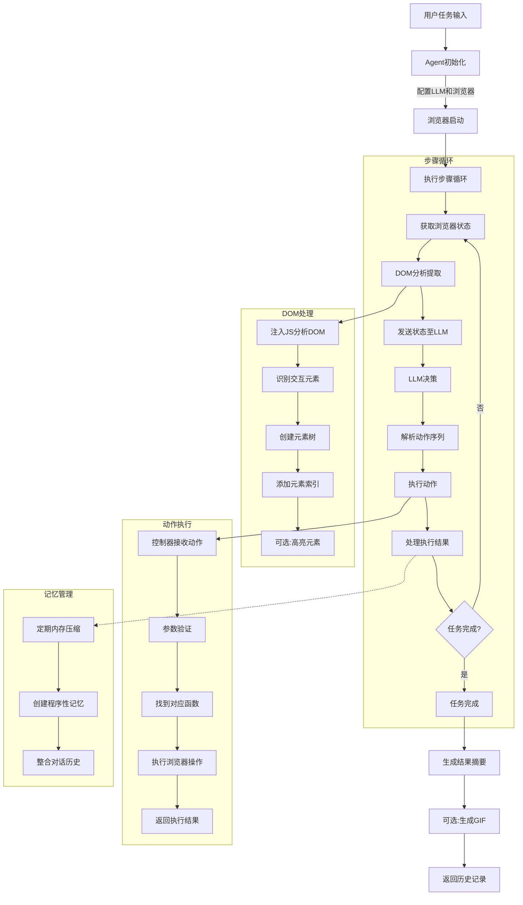

# 深入剖析 Browser Use：基于 AI 的下一代浏览器自动化框架

## 1. 引言：当 AI 遇上浏览器

Browser Use在2025年3月完成了一笔1700万美元的种子轮融资，由Felicis Ventures领投，A Capital、Nexus Ventures、Y Combinator、Paul Graham、Liquid2、SV Angel、Pioneer Fund等跟投。

Browser Use是一款由AI大模型驱动的浏览器自动化代理工具，它能够将网站的按钮和界面元素转化为更易于AI理解的文本式格式，从而让AI智能体能够轻松地“读懂”网站并自动完成复杂任务。这种技术解决了传统基于视觉的系统在浏览网站时容易出错的问题，降低了重复执行相同任务的成本。

Browser Use的两位创始人Gregor Zunic和Magnus Müller都是苏黎世联邦理工学院的学生，他们在2024年相识并共同提出了将网络爬虫与数据科学结合的想法。他们仅用了五周时间就开发出了Browser Use的演示版本，并选择将其开源。核心代码约 8000 行。这个开源项目在GitHub上获得了超过47k个Star，吸引了大量开发者的关注。

Browser Use 所瞄准的市场潜力是巨大的。据估计，全球有 6 亿知识工作者，他们每周将大量时间（约 25%-40%）投入到重复性任务中，其中相当一部分涉及网页操作。通过自动化这些耗时且单调的任务，Browser Use 能够显著提高生产力，释放出巨大的经济价值，为企业和个人创造可观的效益，构成了一个潜力无限的市场。此外，其在企业级场景的应用前景也十分广阔，例如自动化销售线索搜集、竞品价格实时追踪、在线舆情监控、招聘过程中的简历初步筛选等。

Browser Use的近期声名鹊起，部分原因是中国初创公司Butterfly Effect在其病毒式传播的Manus工具中采用了Browser Use技术。目前，Y Combinator冬季批次中已有20多家公司使用Browser Use的解决方案。领投方Felicis的Astasia Myers表示，Web AI代理是下一个真正有助于实现端到端人工任务自动化的前沿领域，是不断变化的数字环境中以文本为中心的静态预训练模型之间的动态桥梁。

本文将从技术架构、核心模块、关键实现、应用场景等多个维度，对 Browser Use 进行全面而深入的剖析，带你领略这一前沿技术的魅力与潜力。

## 2. 核心能力：Browser Use 能做什么？

Browser Use 提供了一套强大的功能集，使 AI 代理能够高效、智能地与 Web 环境交互：

* **AI 驱动的浏览器控制**: 通过健壮的代理架构，将 LLM 的决策能力与 Playwright 等底层自动化工具无缝对接。
* **丰富的 DOM 交互**: 支持页面导航、元素点击、文本输入、滚动、信息提取、下拉菜单处理、拖放等全面的 DOM 操作。
* **多步骤任务规划与执行**: AI 代理能够理解复杂指令，自主规划并执行包含多个步骤的工作流。
* **上下文与记忆管理**: 利用先进的记忆系统（如集成 mem0），在长时间运行的任务中保持状态和上下文连贯性。
* **视觉能力集成 (Vision Integration)**: 能够分析页面截图，结合视觉信息理解页面布局和 UI 元素，增强决策准确性（例如，通过边界框高亮交互元素）。
* **跨浏览器支持**: 基于 Playwright，天然支持 Chromium、Firefox 和 WebKit 等主流浏览器内核。
* **高级特性支持**: 包含跨域 iframe 处理、文件上传/下载、键盘快捷键模拟、会话管理、遥测数据收集等。
* **错误处理与重试**: 内建完善的错误检测、报告和自动重试机制（如指数退避），提高自动化流程的鲁棒性。

## 3. 技术架构：模块化与可扩展性设计

Browser Use 采用了清晰的模块化设计哲学，确保了代码的高内聚、低耦合，易于维护和扩展。其核心架构主要包括以下几个模块：

```
browser_use/
├── agent/           # AI 代理核心：决策、规划、记忆、LLM 交互
│   ├── service.py   # 代理主服务，协调整个流程
│   ├── memory/      # 记忆管理模块 (e.g., using mem0)
│   ├── message_manager/ # 管理与 LLM 的通信历史和上下文
│   ├── prompts/     # 存储和管理系统提示词 (System Prompts)
│   └── views.py     # 定义 Agent 相关的数据模型
├── browser/         # 浏览器控制底层：实例管理、页面操作、配置
│   ├── browser.py   # 浏览器实例创建、生命周期管理 (extends Playwright)
│   ├── context.py   # 浏览器上下文管理 (页面、标签页、状态、截图)
│   ├── chrome.py    # Chrome 特定配置与优化 (e.g., anti-detection)
│   ├── utils/       # 浏览器相关的辅助工具函数
│   └── views.py     # 定义浏览器相关的数据模型
├── controller/      # 动作控制器：定义、注册和执行具体浏览器动作
│   ├── service.py   # 控制器主服务，执行 Agent 决策的动作
│   ├── registry/    # 动作注册表，管理可用动作及其元数据
│   └── views.py     # 定义 Controller 相关的数据模型
├── dom/             # DOM 处理与分析：提取、解析、元素定位
│   ├── service.py   # DOM 分析服务，生成 AI 可理解的页面结构
│   ├── buildDomTree.js # 运行在浏览器端的 JS，用于深度 DOM 分析
│   ├── history_tree_processor/ # 跟踪 DOM 变化，处理动态内容
│   └── views.py     # 定义 DOM 结构相关的数据模型
├── telemetry/       # 遥测服务：匿名使用数据和性能监控
│   ├── service.py   # 遥测数据收集与上报
│   └── views.py     # 定义遥测事件的数据模型
├── utils.py         # 项目级的通用工具函数
├── exceptions.py    # 自定义异常类
└── logging_config.py # 日志配置
```

这种分层、模块化的设计使得：

1. **职责清晰**: 每个模块专注于特定领域（AI 决策、浏览器操作、动作执行、DOM 解析）。
2. **易于扩展**: 可以方便地添加新的 AI 模型、浏览器动作或增强现有模块功能。
3. **可维护性高**: 修改或调试特定功能时，影响范围可控。

以下流程图展示了 Browser Use 的大致工作流程：



## 4. 核心模块详解：深入内部机制

理解 Browser Use 的强大之处，需要深入其核心模块的内部工作机制。

### 4.1 Agent 模块：AI 代理的大脑

Agent 模块是 Browser Use 的智能核心，负责将用户的自然语言任务转化为具体的浏览器操作序列。

* **主要职责**:
  * **任务理解与规划**: 解析用户输入的任务描述。
  * **LLM 交互**: 管理与大型语言模型的通信，包括构建 Prompt、解析响应。
  * **状态管理**: 跟踪任务执行进度、浏览器当前状态、历史操作。
  * **动作决策**: 基于 LLM 的建议和当前上下文，选择下一步要执行的动作。
  * **记忆管理**: 利用 `memory/service.py` 和可能的外部库（如 mem0），压缩和维护对话历史，确保长期任务的上下文连贯性，优化 Token 消耗。
  * **错误处理**: 捕获执行过程中的错误，并根据策略进行重试或上报。

* **关键组件**:
  * `Agent` (`service.py`): 代理主类， 统筹整个工作流程。它接收任务，循环执行 "感知-思考-行动" 的步骤。
  * `MessageManager` (`message_manager/service.py`): 精心管理与 LLM 的对话历史。它负责格式化浏览器状态（DOM 结构、截图、URL 等）、历史动作结果，并根据 Token 限制进行剪枝，构建高效的 Prompt。
  * `Memory` (`memory/service.py`): 实现长期和短期记忆。例如，使用 mem0 创建过程记忆摘要，定期压缩历史信息。
  * **System Prompt** (`system_prompt.md`, managed by `prompts.py`): 这是指导 LLM 如何工作的关键指令集。它定义了 Agent 的角色、能力、可用动作的格式和描述、如何解读浏览器状态以及完成任务的标准。

* **工作流程**:
    1. **初始化**: 创建 Agent 实例，配置 LLM、浏览器、记忆系统，并通过 Controller Registry 加载可用动作。检测 LLM 是否支持特定的工具调用方法（如 Function Calling）。
    2. **执行步骤 (Step Execution)**:
        * **感知**: 获取当前浏览器状态（调用 Browser 和 DOM 模块获取 URL、DOM 结构、截图等）。
        * **思考**: `MessageManager` 格式化状态和历史，构建 Prompt 发送给 LLM。LLM 返回下一步的动作建议（通常是 JSON 格式）。
        * **行动**: 解析 LLM 返回的动作指令（可能是单个动作或序列），调用 `Controller` 执行。
    3. **结果处理与记忆更新**: 记录动作执行结果，更新 `MessageManager` 中的历史，必要时触发 `Memory` 进行信息压缩。
    4. **错误处理**: 若动作执行失败，记录错误信息，根据配置进行重试（如指数退避）。多次失败后可能中止任务或请求人工干预。
    5. **循环/终止**: 重复步骤 2-4，直到 LLM 判断任务完成（例如，调用 `done` 动作）或达到最大步数限制。

* **技术细节**:
  * **Tool Calling**: 自动检测并适配不同的 LLM 工具调用机制（如 OpenAI Function Calling, Anthropic Tools, 或解析原始 JSON 输出）。
  * **Vision Integration**: 可将页面截图（甚至带有交互元素高亮的截图）作为输入提供给支持视觉能力的 LLM，使其能"看到"页面布局。
  * **State Management**: 精确跟踪每一步的状态、动作、结果，支持任务的暂停、恢复和调试。

### 4.2 Browser 模块：连接现实世界的桥梁

Browser 模块封装了与底层浏览器自动化工具（主要是 Playwright）的交互细节，并提供了增强功能以更好地服务于 AI Agent。

* **主要职责**:
  * **浏览器实例管理**: 创建、连接（新实例、WSS、CDP）、关闭浏览器进程。
  * **浏览器上下文管理**: 维护隔离的浏览会话（`BrowserContext`），处理 Cookies、存储、认证状态等。
  * **页面操作**: 封装导航（跳转、前进、后退、刷新）、标签页管理（打开、切换、关闭）、窗口控制（大小、位置）。
  * **状态获取**: 提供获取页面 URL、标题、截图、渲染后 HTML 等信息的接口。
  * **配置与优化**: 应用启动参数，特别是针对自动化场景的优化（如 `chrome.py` 中的反检测设置）。

* **关键组件**:
  * `Browser` (`browser.py`): 核心类，负责浏览器实例的生命周期和连接管理。
  * `BrowserContext` (`context.py`): 代表一个独立的浏览器会话环境。管理页面状态、执行 JS 脚本、处理下载、截屏等。这是 Agent 进行实际操作的主要交互对象。
  * `BrowserContextConfig` (`views.py`): 定义浏览器上下文的配置选项（视口大小、用户代理、地理位置模拟等）。
  * `Chrome specific configurations` (`chrome.py`): 包含一系列针对 Chrome/Chromium 的优化启动参数，旨在减少被网站检测为机器人的概率（反指纹、WebGL/Canvas 伪装、请求头修改等），并确保渲染的确定性。
  * `Utils` (`utils/`): 提供屏幕分辨率检测、窗口调整等辅助功能。

* **工作流程**:
    1. **初始化**: 根据配置（新实例、连接已有 WSS/CDP 端点）启动或连接浏览器。应用 `chrome.py` 等模块定义的优化参数。
    2. **创建上下文**: 为每个 Agent 任务创建一个隔离的 `BrowserContext`，确保会话纯净。
    3. **页面交互**: Agent 通过 `BrowserContext` 执行导航、获取状态、与页面元素交互（间接通过 Controller 和 DOM 模块）。
    4. **资源管理**: 任务结束后，正确关闭 `BrowserContext` 和浏览器实例，释放资源。

* **技术细节**:
  * **连接方式**: 支持启动全新浏览器实例、通过 WebSocket (WSS) 连接到已运行的浏览器（方便调试或复用）、通过 Chrome DevTools Protocol (CDP) 进行更底层的控制。
  * **反检测技术**: 这是 Browser Use 的一个重要特性。通过精心配置 User-Agent、navigator 对象属性、WebGL 参数、Canvas 指纹、屏幕分辨率、字体、插件信息等，模拟真实用户环境，绕过一些网站的反爬虫或自动化检测机制。
  * **配置选项**: 提供丰富的配置项，如无头模式 (headless)、代理设置、下载路径、超时时间等。

### 4.3 Controller 模块：动作的执行者

Controller 模块是 Agent 决策与 Browser 底层操作之间的桥梁。它定义、注册并执行 Agent 可以调用的具体原子动作。

* **主要职责**:
  * **动作定义**: 提供一系列预定义的、结构化的浏览器操作函数（如点击、输入、滚动、导航等）。
  * **动作注册**: 通过 `Registry` (`registry/service.py`) 维护一个可用动作的目录，包含动作名称、描述（供 LLM 理解）、参数定义（使用 Pydantic 模型进行类型检查和验证）。
  * **动作执行**: 接收 Agent 的动作请求，验证参数，调用相应的 Browser 或 DOM 模块功能来执行动作。
  * **结果封装**: 将动作执行结果（成功/失败状态、消息、提取的数据等）封装成标准格式 (`ActionResult`) 返回给 Agent。

* **关键组件**:
  * `Controller` (`service.py`): 主服务类，提供统一的动作执行入口 (`execute_action`)。
  * `Registry` (`registry/service.py`): 动作注册中心。使用装饰器等方式方便地注册新动作，并能根据上下文（如当前页面状态）动态过滤可用动作。
  * **Action Definitions**: 内置大量原子操作，覆盖了常见的网页交互需求：
    * 导航: `go_to_url`, `go_back`, `refresh_page`, `search_google`
    * 元素交互: `click_element`, `input_text`, `scroll_element`, `hover_element`, `select_dropdown_option`, `drag_drop`
    * 页面与标签页: `switch_tab`, `open_tab`, `close_tab`, `get_url`, `capture_screenshot`
    * 内容提取: `extract_content`, `extract_table`, `get_html`
    * 文件操作: `upload_file`, `save_pdf`, `save_html_to_file`
    * 任务控制: `done` (表示任务完成)

* **工作流程**:
    1. **注册**: 初始化时，所有内置或自定义的动作被注册到 `Registry`，包含其元数据（描述、参数模型）。
    2. **执行**: Agent 请求执行某个动作并提供参数。`Controller` 使用 `Registry` 查找动作定义，利用 Pydantic 模型验证参数的类型和值。
    3. **调用**: 调用动作对应的实现函数，传入验证后的参数和当前的 `BrowserContext`。
    4. **返回**: 动作执行完毕后，封装结果（包括是否成功、返回消息、可能提取的数据）为 `ActionResult` 对象，返回给 Agent。

* **技术细节**:
  * **Pydantic 集成**: 强制使用 Pydantic 定义动作参数，确保了类型安全和数据验证，减少了运行时错误，并能自动生成供 LLM 理解的参数模式。
  * **描述性元数据**: 每个动作都附带清晰的自然语言描述，这是 LLM 理解何时以及如何使用该动作的关键。
  * **可扩展性**: 用户可以轻松定义并注册自己的 `Custom Action`，以满足特定网站或复杂工作流的需求。
  * **同步/异步**: 支持执行同步和异步动作函数。

### 4.4 DOM 模块：理解网页的眼睛

DOM 模块负责解析网页的文档对象模型（DOM），将其转化为一种结构化的、对 AI Agent 更友好的格式，并支持精确的元素定位。

* **主要职责**:
  * **DOM 提取与分析**: 运行特定的 JavaScript (`buildDomTree.js`) 在浏览器端，深度分析 DOM 树，识别可见、可交互的元素（按钮、链接、输入框等）。
  * **结构化表示**: 将复杂的 HTML 结构转化为简化的、带有索引的树状或列表表示，突出关键元素及其属性（类型、文本、位置、可交互性）。
  * **元素定位**: 建立从 Agent 使用的简洁索引 (e.g., `element_index: 12`) 到浏览器内部可靠定位符（如 XPath, CSS Selector）的映射。
  * **动态内容处理**: 通过 `HistoryTreeProcessor` 等机制，尝试跟踪 DOM 随时间的变化，处理由 JavaScript 动态加载或修改的内容。
  * **跨域与 Shadow DOM 处理**: 尝试处理跨域 `iframe` 和 `Shadow DOM` 内的元素，扩大可交互范围。

* **关键组件**:
  * `DomService` (`service.py`): 提供获取和处理 DOM 状态的核心服务。
  * `buildDomTree.js`: 在目标网页的上下文中执行的 JavaScript 代码。这是 DOM 分析的核心，负责遍历 DOM、评估元素可见性/可交互性、分配索引、计算边界框（用于截图高亮）、并进行性能优化（如缓存）。
  * `HistoryTreeProcessor` (`history_tree_processor/service.py`): 用于比较不同时间点的 DOM 树，帮助识别持久化元素，应对动态页面更新。
  * `DOMElementNode`, `DOMState` (`views.py`): 定义用于表示 DOM 元素及其状态的数据结构，包含标签名、属性、文本内容、索引、可见性、交互状态、边界框坐标等信息。

* **工作流程**:
    1. **注入与执行**: `DomService` 通过 `BrowserContext` 将 `buildDomTree.js` 注入到当前页面并执行。
    2. **分析与构建**: JS 代码遍历 DOM，应用一系列规则（检查 `display`, `visibility`, `opacity`, `pointer-events`, 尺寸，事件监听器等）来判断元素是否"重要"且"可交互"。为这些元素分配唯一索引，并构建一个包含相关信息的 JSON 结构。
    3. **传输与解析**: JS 将分析结果返回给 Python 后端 (`DomService`)。
    4. **状态生成**: `DomService` 解析 JS 返回的数据，构建 `DOMState` 对象，其中包含一个易于 LLM 理解的元素列表或树，以及索引到选择器的映射。
    5. **高亮 (可选)**: 如果启用了视觉功能，`buildDomTree.js` 还会计算元素的边界框，用于在截图上绘制高亮矩形，帮助 LLM 将视觉信息与元素索引关联起来。

* **技术细节**:
  * **元素重要性评估**: 不仅仅是提取所有元素，而是侧重于用户可能与之交互的元素，大大减少了传递给 LLM 的信息量。
  * **性能优化**: `buildDomTree.js` 内部包含缓存机制（如缓存 `getBoundingClientRect` 结果）、高效遍历算法、节流/防抖处理，以应对复杂和动态页面。
  * **选择器策略**: 主要依赖 XPath，因其在复杂和动态 DOM 结构中通常比 CSS Selector 更稳定。但也可能结合其他策略。
  * **Iframe 和 Shadow DOM**: 尝试透明地处理这些复杂结构，将内部的可交互元素也纳入索引体系（受同源策略等安全限制）。

### 4.5 Telemetry 模块：匿名的反馈回路

Telemetry 模块负责收集匿名的使用数据和性能指标，帮助开发者理解库的使用情况、发现潜在问题并持续改进产品，同时尊重用户隐私。

* **主要职责**:
  * **匿名数据收集**: 记录 Agent 运行、步骤执行、动作调用、错误发生等事件。
  * **性能监控**: 收集如 Token 使用量、执行时间等性能相关指标。
  * **用户标识**: 创建匿名的、持久化的用户 ID，用于聚合统计，而非识别个人。
  * **隐私控制**: 提供明确的退出机制（如环境变量 `ANONYMIZED_TELEMETRY=false`）。
  * **数据上报**: 将收集到的匿名数据异步发送到后端分析平台（如 PostHog）。

* **关键组件**:
  * `ProductTelemetry` (`service.py`): 实现为单例模式，管理遥测服务的生命周期和事件发送。
  * **Event Models** (`views.py`): 使用 Pydantic 定义各种遥测事件的结构，如 `AgentRunTelemetryEvent`, `AgentStepTelemetryEvent`, `AgentEndTelemetryEvent` 等，确保数据格式一致。

* **工作流程**:
    1. **初始化**: 检查用户是否选择退出。若未退出，则生成或加载匿名用户 ID，并初始化与后端（如 PostHog）的连接。
    2. **事件捕获**: 在代码的关键位置（如 Agent 启动/结束、执行动作、发生错误时）调用 `ProductTelemetry` 的方法记录事件。
    3. **异步发送**: 将事件数据放入队列，由后台线程异步发送，避免阻塞主流程。
    4. **错误处理**: 如果数据发送失败，会进行重试或静默失败，不影响核心功能。

* **技术细节**:
  * **后端集成**: 使用 PostHog 等第三方服务进行数据存储和分析。
  * **隐私保护**: 严格遵守匿名化原则，不收集任何 PII（个人身份信息）。收集的数据点在文档中有明确说明。
  * **配置**: 通过环境变量控制遥测功能的开关。

## 5. 技术特性与优势总结

Browser Use 凭借其精心设计的架构和先进技术，展现出显著的优势：

1. **智能化 (Intelligence)**: 核心驱动力是 LLM，使其能够理解复杂任务、进行推理规划，处理非结构化数据，适应变化的网页。
2. **强大的交互能力 (Rich Interaction)**: 提供了远超传统工具的丰富、精细的 DOM 操作集合。
3. **异步化与高性能 (Asynchronous & High-Performance)**: 全面拥抱 Python `asyncio`，支持高并发的 I/O 操作（网络请求、浏览器通信），结合 DOM 处理优化，提升执行效率。
4. **模块化与可扩展性 (Modular & Extensible)**: 清晰的架构易于理解、维护和扩展。可以方便地添加自定义动作、集成新的 LLM 或浏览器类型。
5. **鲁棒性 (Robustness)**: 内建的错误处理、重试机制以及详细的日志记录，提高了自动化流程在面对网络波动、页面变化时的稳定性。
6. **视觉增强 (Vision Enhanced)**: 结合截图和视觉模型，使 Agent 能"看懂"页面，处理仅靠 DOM 难以解决的问题（如图标按钮、Canvas 元素等）。
7. **反检测能力 (Anti-Detection)**: 集成多种策略，努力模拟真实用户环境，降低被网站识别和阻止的风险。
8. **记忆与上下文管理 (Memory & Context)**: 通过专门的记忆系统，有效处理长流程任务，避免"遗忘"之前的步骤和信息。

## 6. 使用流程：如何驾驭 Browser Use

开发者使用 Browser Use 的典型流程如下：

1. **安装与配置**:
    * 通过 pip 安装库: `pip install browser-use`（或者使用推荐的 `uv pip install browser-use`）
    * 安装 Playwright 浏览器驱动: `playwright install`（默认安装所有浏览器）
    * 设置环境变量，如 LLM API 密钥（`OPENAI_API_KEY` 或 `ANTHROPIC_API_KEY` 等），可以通过 `.env` 文件配置。

2. **代码实现**:
    * 导入必要的类: `Agent` 和相应的 LLM 客户端（如 `ChatOpenAI` 或 `ChatAnthropic`）
    * 配置 LLM 实例: 从 LangChain 导入并配置相应的语言模型
    * 定义任务: 用自然语言清晰描述 Agent 需要完成的目标
    * 配置 Agent: 实例化 `Agent`，传入任务描述和 LLM 实例，以及可选的其他配置
    * 执行任务: 调用 `agent.run()` (在异步函数中使用 `await agent.run()` 或 `asyncio.run(agent.run())`)

    ```python
    import asyncio
    from langchain_openai import ChatOpenAI
    from browser_use import Agent
    from dotenv import load_dotenv
    
    load_dotenv()  # 加载环境变量
    
    async def main():
        # 配置 LLM
        llm = ChatOpenAI(
            model="gpt-4o", 
            temperature=0.0  # 使用低温度值提高确定性
        )
        
        # 定义任务
        task = "访问 https://github.com/trending，找到今天 Python 语言最热门的仓库，并告诉我它的名称和描述。"
        
        # 创建并配置 Agent
        agent = Agent(
            task=task,
            llm=llm,
            # 可选配置:
            # browser_config={"headless": False},  # 非无头模式运行
            # vision_enabled=True,  # 启用视觉能力
            # max_steps=20,  # 设置最大执行步数
        )
        
        # 执行任务
        result = await agent.run()
        
        # 处理结果
        print(result)  # 打印结果
    
    if __name__ == "__main__":
        asyncio.run(main())
    ```

3. **结果分析与调试**:
    * 检查 Agent 返回的结果（通常是任务的最终输出）
    * 根据需要分析日志输出，了解每一步的决策过程和遇到的问题

4. **高级用法**:
    * **自定义动作**: 为特定网站或任务编写并注册自定义动作
    * **人机协作 (Human-in-the-Loop)**: 在关键步骤加入回调，允许人工审核或干预
    * **复杂工作流编排**: 将大任务分解为子任务，利用记忆系统传递上下文
    * **集成**: 将 Browser Use 作为模块嵌入到更大的应用程序或服务中

## 7. 局限性与挑战：保持清醒的认知

尽管 Browser Use 功能强大，但在实际应用中也面临一些限制和挑战：

* **LLM 依赖**:
  * **成本**: 调用先进 LLM (尤其是带视觉能力的) API 会产生费用，长任务可能成本较高。
  * **性能**: LLM 的响应速度会影响整体执行效率。
  * **可靠性**: LLM 可能产生"幻觉"，做出错误的决策或解析错误。其能力上限决定了 Agent 的智能水平。
  * **Token 限制**: LLM 的上下文窗口大小限制了单次交互能处理的信息量，对极其复杂的页面或超长任务构成挑战。
* **DOM/网页复杂度**:
  * **极端复杂的 DOM**: 对于层级极深、节点数量巨大的页面，DOM 分析可能耗时较长。
  * **非标准或混淆的 HTML/JS**: 难以解析和交互。
  * **Canvas/WebGL 应用**: 主要依赖视觉能力，交互精度有限。
  * **动态内容与 SPA**: 单页应用 (SPA) 的路由和状态管理、WebSocket 实时更新等可能干扰 Agent 的状态感知和动作执行。
* **反自动化措施**:
  * **高级反爬虫**: 复杂的 JavaScript 挑战、人机验证码 (CAPTCHA)、鼠标轨迹分析等仍是巨大障碍。Browser Use 的反检测能力并非万能。
* **稳定性和鲁棒性**:
  * **页面加载时序**: 网络延迟或页面元素异步加载可能导致元素定位失败（Flakiness）。
  * **UI 变化**: 网站频繁的 UI 更新或 A/B 测试可能导致 Agent 失效。
* **安全与合规**:
  * **网站 ToS**: 自动化操作需遵守目标网站的服务条款。
  * **数据隐私**: 处理用户输入或抓取的数据时需注意隐私保护。
  * **误操作风险**: AI Agent 的自主性可能导致意外操作，需谨慎用于敏感场景。

## 8. 未来发展：Browser Use 的星辰大海

Browser Use 社区和开发者正积极规划其未来发展方向：

* **Agent 智能增强**: 更优的记忆压缩与检索算法、更强的任务规划能力、更智能的错误恢复策略、更低的 Token 消耗。
* **DOM 处理改进**: 针对特定 UI 控件（日期选择器、复杂表格等）的专用解析器、更高效的动态内容跟踪。
* **工作流自动化**: 支持任务模板化、可重放的会话录制（甚至生成 Playwright 脚本）、更好的人机协作接口。
* **基准测试与数据集**: 建立标准化的评测任务集，用于评估不同 LLM 在浏览器自动化任务上的表现，发布排行榜。
* **可视化与调试**: 提升 GIF/视频录制质量、提供实时监控仪表盘、增强调试工具。
* **更广泛的平台支持**: 完善 Firefox/WebKit 支持、探索移动端浏览器自动化、支持浏览器扩展交互。
* **生态与集成**: 发展云服务、提供企业级功能、与更多 AI 平台集成、鼓励社区贡献动作库。
* **AI 友好的 Web 设计**: 与 Web 开发者合作，探索和推广有利于 AI Agent 理解和交互的网页设计规范。

## 9. 最佳实践与注意事项

作为技术专家，我建议在使用 Browser Use 时关注以下几点：

1. **明确任务边界**: 对于高度动态、强对抗或安全关键的任务，谨慎评估适用性。
2. **选择合适的 LLM**: 根据任务复杂度、成本预算、是否需要视觉能力来选择模型。注意模型的 Token 限制和 API 速率限制。
3. **精心设计任务描述 (Prompt Engineering)**: 清晰、具体、无歧义的任务描述是 Agent 成功的关键。
4. **利用反检测配置**: 根据目标网站的特点，合理配置反检测选项，但要避免滥用。
5. **处理动态内容**: 对于 AJAX 加载、SPA 路由变化等，可能需要增加等待、重试或更复杂的逻辑。考虑结合 `HistoryTreeProcessor`。
6. **错误处理与监控**: 实现健壮的错误处理逻辑，并监控 Agent 的执行状态和资源消耗。
7. **成本控制**: 监控 LLM API 调用次数和 Token 消耗，优化 Prompt 和 Agent 逻辑以降低成本。
8. **遵守法律法规和网站规则**: 负责任地使用自动化能力，尊重网站 ToS，保护数据隐私。
9. **迭代优化**: 从简单的任务开始，逐步增加复杂度，根据实际运行效果不断调整任务描述、配置或添加自定义动作。

## 10. 总结：开启智能自动化新篇章

Browser Use 不仅仅是一个工具库，它代表了 AI 技术与 Web 自动化深度融合的未来方向。通过将 LLM 的认知能力赋予浏览器，它极大地扩展了自动化的边界，使得处理以往难以自动化的复杂、动态、需要理解和决策的网页任务成为可能。

尽管仍面临 LLM 能力限制、网站复杂性、反自动化措施等挑战，但其展现出的潜力是巨大的。随着底层 AI 模型、浏览器技术以及 Browser Use 自身的不断演进，我们有理由相信，它将在网页数据提取、自动化测试、智能 RPA、数字助理等领域扮演越来越重要的角色。

对于希望探索 AI 驱动的 Web 自动化的开发者和企业而言，Browser Use 提供了一个功能强大、设计精良且充满前景的框架。

## 11. 进一步学习资源

* **官方 GitHub 仓库**: https://github.com/browser-use/browser-use
* **官方文档**: https://docs.browser-use.com
* **示例代码**: https://github.com/browser-use/web-ui
* **社区**: https://discord.com/invite/fqPB2NCNKV
